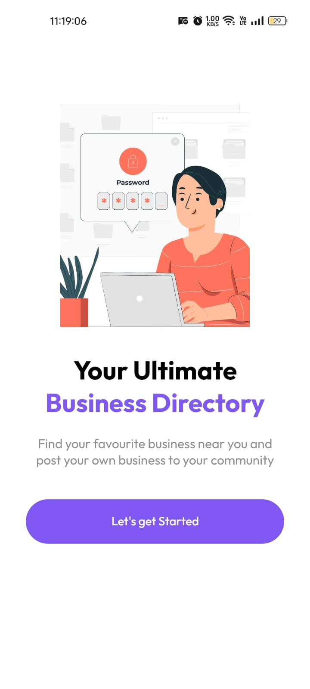
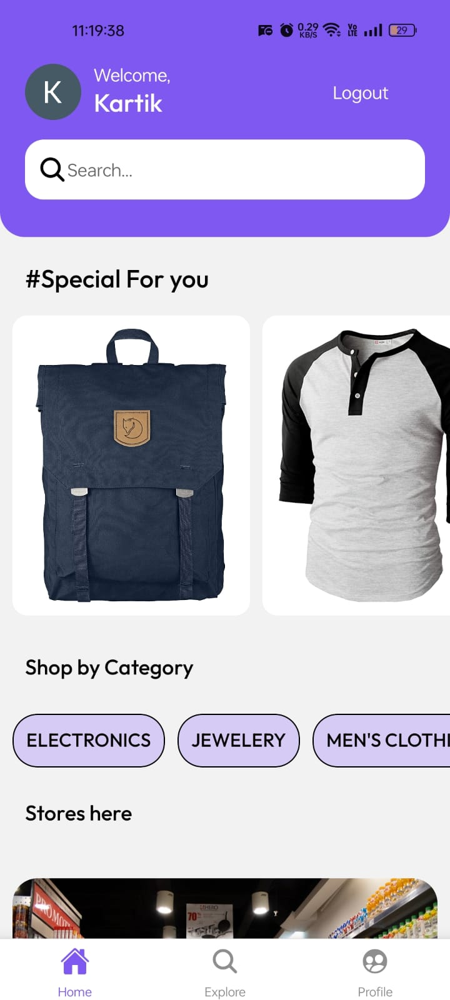
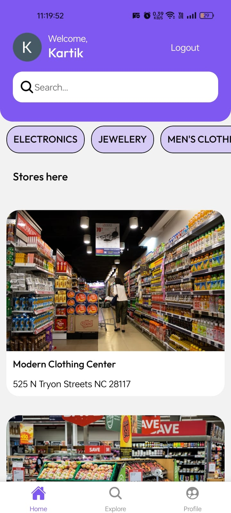
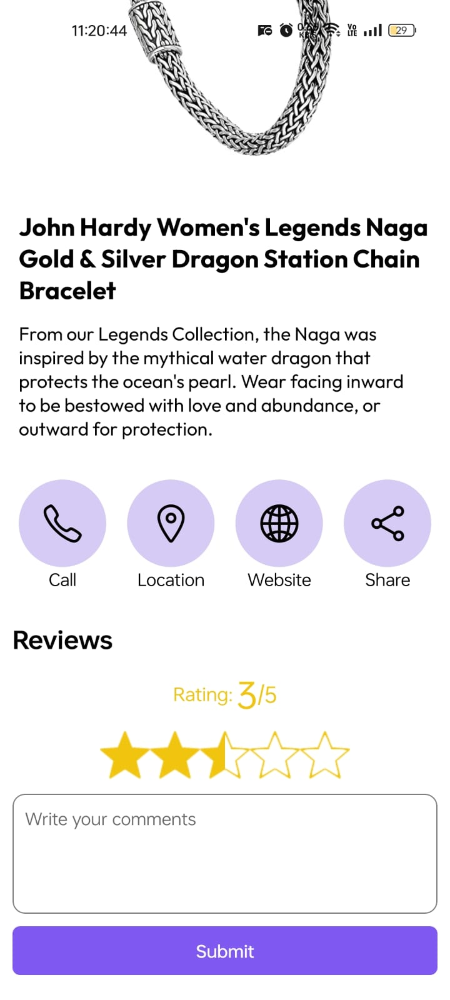
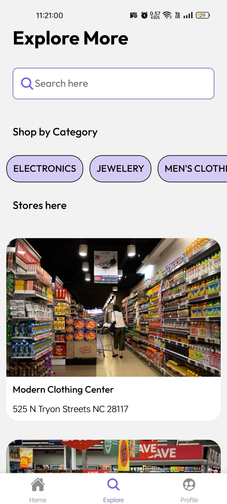
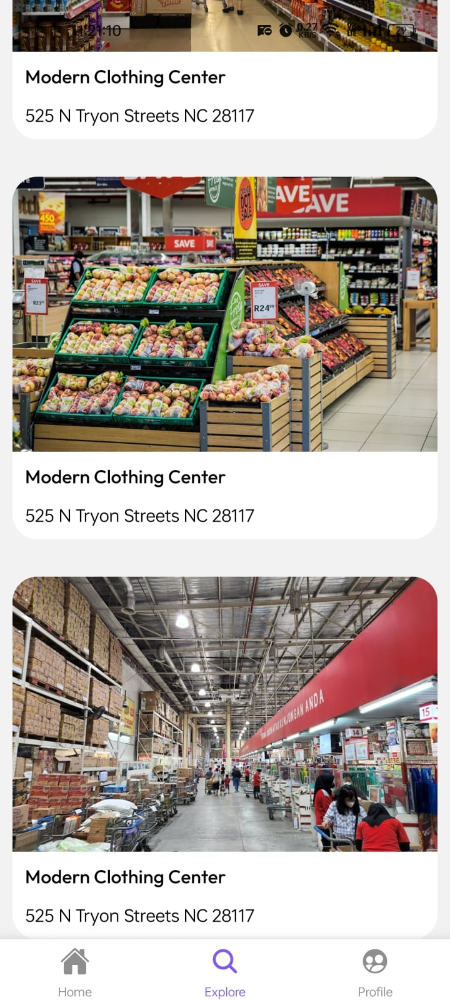
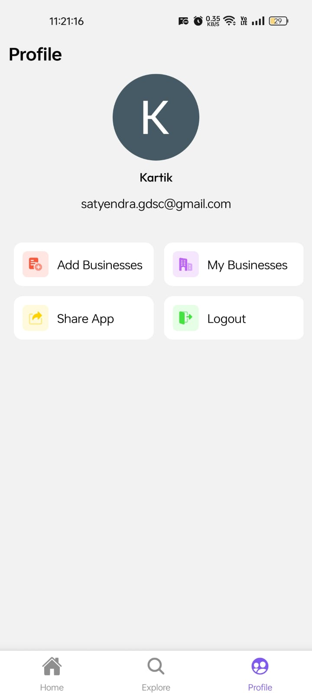

# React Native Business Directory App with Clerk

This is a React Native FinTech clone using [Clerk](https://go.clerk.com/tQXLCe8) for user authentication with Google.
Business Owners can List their businesses and products.

Additional features:

- [Expo Router](https://docs.expo.dev/routing/introduction/) file-based navigation and API Routes
- [Google login](https://clerk.com/docs/custom-flows/email-sms-otp?utm_source=sponsorship&utm_medium=github&utm_campaign=simong&utm_content=rn-fintech) Auth with Clerk

## Screenshots

<div style="display: flex; flex-direction: 'row';">










</div>


## Get started

Need to add a .env file in root directory for
```bash
EXPO_PUBLIC_CLERK_PUBLISHABLE_KEY="key_of_clerk"
```

1. Install dependencies

   ```bash
   npm install
   ```

2. Start the app

   ```bash
    npx expo start
   ```

Install Expo Go App in your phone or run with simulator
